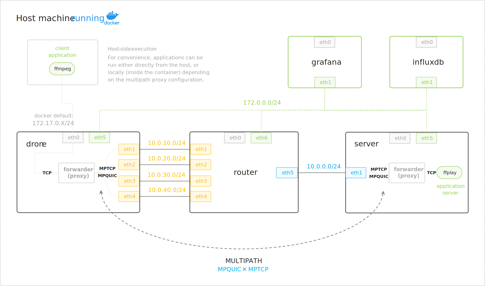

<a name="readme-top"></a>

<!-- PROJECT TITLE -->
<h1 align="center">
Multipath Network Protocols Lab
</h1>

<p align="center">
  <a href="#about-the-project">About The Project</a> •
  <a href="#getting-started">Getting Started</a> •
  <a href="#usage">Usage</a> •
  <a href="#related">Related</a> •
  <a href="#license">License</a>
</p>

<!-- TABLE OF CONTENTS -->

<details>
  <summary>Table of Contents</summary>
  <ol>
    <li>
      <a href="#about-the-project">About The Project</a>
      <ul>
        <li><a href="#built-with">Built With</a></li>
      </ul>
    </li>
    <li>
      <a href="#getting-started">Getting Started</a>
      <ul>
        <li><a href="#prerequisites">Prerequisites</a></li>
        <li><a href="#deployment">Deployment</a></li>
      </ul>
    </li>
    <li>
      <a href="#usage">Usage</a>
      <ul>
        <li><a href="#testbed-overview">Testbed Overview</a></li>
        <li><a href="#generating-and-visualizing-traffic">Generating and Visualizing Traffic</a></li>
        <li><a href="#modifying-network-conditions">Modifying Network Conditions</a></li>
        <li><a href="#limitations">Limitations</a></li>
      </ul>
    </li>
    <li><a href="#related">Related</a></li>
    <li><a href="#license">License</a></li>
  </ol>
</details>

<!-- ABOUT THE PROJECT -->
## About The Project


This project is built with Vagrant using Docker as a provider and Ansible for provisioning. 
Once deployed, the proposed virtual environment intends to perform tests on multipath transport protocols such as MPQUIC and MPTCP. 

This configuration allows testing different scenarios with varying network conditions on each interface using the Linux [Traffic Control (TC)](https://man7.org/linux/man-pages/man8/tc.8.html) and [Network Emulator (NetEm)](https://man7.org/linux/man-pages/man8/tc-netem.8.html) tool suite. 
In that matter, this lab aims to explore the mechanisms of these multipath protocols, observe their performance under different traffic types and conditions, and evaluate their use for live video streaming applications (bandwidth aggregation, latency).

### Built With

| <!-- --> | <!-- --> |
| -------- | -------- |
| [![VagrantUp.com][Vagrant]][Vagrant-url] | Hashicorp open source software for building portable virtual environments |
| [![Docker.com][Docker]][Docker-url] |Open source platform for building, shipping, and running containers
| [![Ansible.com][Ansible]][Ansible-url] | Red Hat open source automation tool
| [![Grafana.com][Grafana]][Grafana-url] | Open source data visualization and monitoring solution
| [![InfluxData.com][InfluxDB]][InfluxDB-url] | Open source time series database (TSDB)

<p align="right">(<a href="#readme-top">back to top</a>)</p>

## Getting Started

### Prerequisites

To properly build this lab, the following setup is required:


* Host machine running a recent Linux distribution like [Ubuntu 22.04 LTS](https://canonical.com/blog/ubuntu-22-04-lts-released) that comes with a recent Linux kernel having built-in MPTCP support enabled by default (kernel version ≥ 5.15.x)
* MPTCP is enabled in the kernel: `sudo sysctl -a | grep mptcp.enabled`

* [Vagrant](https://developer.hashicorp.com/vagrant/downloads), [Docker](https://docs.docker.com/engine/install/ubuntu/) and [Ansible](https://docs.ansible.com/ansible/latest/installation_guide/installation_distros.html#installing-ansible-on-ubuntu) are installed on the host.  


### Deployment

1. Clone this repository:

```sh
git clone https://github.com/paulbertin/multipath-network-protocols-lab
```

2. Build the custom image from the Dockerfile, with the tag `vagrant-ubuntu-22.04`:

```sh
docker build -t vagrant-ubuntu-22.04 multipath-network-protocols-lab/docker/ubuntu
```

3. Run the Vagrantfile:

```sh
cd multipath-network-protocols-lab
vagrant up
```

4. Check that the containers are running:

```sh
# Using vagrant command
vagrant status
# Alternatively, you can use the Docker CLI to get more details
docker ps
```

5. Now, Grafana and InfluxDB dashboards should be accessible from the host:


| <!--    --> | Address | Credentials (login:password) |
| ----------- | ------- | ----------- |
| **Grafana** | [http://localhost:3000](http://127.0.0.1:3000) | `admin`:`grafana` | 
| **InfluxDB** | [http://localhost:8086](http://127.0.0.1:8086) | `admin`:`influxdb` |

<p align="right">(<a href="#readme-top">back to top</a>)</p>

## Usage

### Testbed Overview



This lab is composed of 5 containers:

| Container name | Description |
| --- | --- |
| **`drone`** | Runs a proxy and a client application that sends traffic to the server |
| **`router`** | Transparently forwards traffic between the client and the server |
| **`server`** | Runs a proxy and a server application that receives traffic from the client |
| **`influxdb`** | A time series database used to store the metrics collected by [Telegraf](https://www.influxdata.com/time-series-platform/telegraf/). Telegraf is a data collection agent running on each of the 3 containers (drone, router, server), that collects metrics from the network interfaces (using [Net Monitoring plugin](https://www.influxdata.com/integration/net/)) and sends them to the **influxdb** container.
| **`grafana`** | A data visualization and monitoring solution that is connected to influxdb and displays the metrics collected by telegraf. |

The proxies on `drone` and `server` are used to forward traffic between the client and the server using either MPTCP or MPQUIC.
The client and server applications are used to generate traffic and evaluate the performance of these multipath transport protocols.

Most applications do not support multipath natively and require development to enable this feature. As a workaround, the provided proxies work in pairs (on both the server and client-side) to split the TCP connection and transmit all TCP-based application data over a multipath transport layer. 

> **Note:** While proxying allows us to quickly test the behavior of these protocols under various application traffic patterns, please note that this is not an efficient solution for production. Applications need specific algorithms and adaptations to leverage multipath for their use cases.


<p align="right">(<a href="#readme-top">back to top</a>)</p>

### Generating and Visualizing Traffic


This demo implies that the virtual environment is already deployed and running. It features:
* TCP application traffic proxying via MPTCP or MPQUIC (sections [A)](#a-proxying-using-mptcp) or [B)](#b-proxying-using-mpquic)).
* Traffic generation using `ffmpeg` application for live video streaming from `drone` to `server` container.
* Real-time per-interface network bandwidth usage visualization on Grafana.


#### A) Proxying using MPTCP 

<details><summary>Show instructions</summary>

1. Start the MPTCP proxy on `server` container:

```sh
# SSH into the server container
vagrant ssh server
# Start the MPTCP proxy (MPTCP to TCP)
./mptcp_forwarders/mptcp-tcp-forwarder.py -l 10.0.0.30:3333 -d 127.0.0.1:3333
```

2. Start the MPTCP proxy on `drone` container:

```sh
# SSH into the drone container
vagrant ssh drone
# Start the MPTCP proxy (TCP to MPTCP)
./mptcp_forwarders/tcp-mptcp-forwarder.py -l <eth0 ip address>:1111 -d 10.0.0.30:3333
```

> **Note:** The IP address of `eth0` interface can be retrieved using the `ip a` command. This IP address is dynamically allocated by Docker (default network) and is reachable from the host machine. It is used to connect to the proxy from the client application that can be executed either on host side or within the `drone` container. 

The above set the following forwarding rules:

* The proxy on `drone` container listens for TCP connections on `eth0` (port 1111). 
* Incoming TCP traffic is forwarded from `drone` to the MPTCP proxy running on `server` container (port 3333).
* The proxy on `server` container receives MPTCP traffic on `eth1` (port 3333)
* Incoming MPTCP traffic is forwarded to the TCP application server running locally on `server` container (port 3333).

</details>

#### B) Proxying using MPQUIC

<details><summary>Show instructions</summary>

1. Start the MPQUIC proxy on `server` container:

```sh
# SSH into the server container
vagrant ssh server
# Start the MPQUIC proxy (MPQUIC to TCP)
./mpquic_forwarder/start_server_demo.sh
```

2. Start the MPQUIC proxy on `drone` container:

```sh
# SSH into the drone container
vagrant ssh drone
# Start the MPQUIC proxy (TCP to MPQUIC)
./mpquic_forwarder/start_client_demo.sh
```

> **Note:** By default, MPQUIC proxy on `drone` container listen for TCP connection on 127.0.0.1:1111. You can change the listening address by replacing the `listen_addr` value at **line 268** in [mpquic_forwarder/src/client.rs](https://github.com/imt-atlantique-procom/mpquic_forwarder/blob/main/src/client.rs). 
> Alternatively, use this one liner to replace the value: `sed -i "s/127.0.0.1/<drone_eth0_ipaddr>/g" mpquic_forwarder/src/client.rs`	

</details>

#### Generating traffic using `ffmpeg`

<details><summary>Show instructions</summary>

1. Start the `ffplay` server application on `server` container:

```sh
# SSH into the server container
vagrant ssh server
# Start the ffplay server application (listen on same port as the proxy forwards to)
ffplay -fflags nobuffer -flags low_delay -framedrop tcp://localhost:3333?listen
```

2. Start the `ffmpeg` client application (on host machine):

```sh
# Start the ffmpeg client application (connect to the proxy on drone)
ffmpeg -re -f v4l2 -i /dev/video0 -pix_fmt yuv420p -preset ultrafast -tune zerolatency -fflags nobuffer -b:v 2000k -vf scale=960x720 -f mpegts tcp://<drone_eth0_ipaddr>:1111
```

The above instruction executes `ffmpeg` on the host machine to access the laptop camera:
* The `ffmpeg` client application connects to the proxy on `drone` container.
* The proxy forwards the traffic to the `ffplay` server application on `server` container.
* The `ffplay` application displays the video stream on the host machine (X11 ).

> Please refer to the [ffmpeg documentation](https://ffmpeg.org/ffmpeg.html) for more information on the command line options.
> It is also possible to stream a pre-recorded video file (such as in the demonstration) using the following command: `ffmpeg -re -i <video_file> -preset ultrafast -tune zerolatency -fflags nobuffer -b:v 2000k -vf scale=1920x1080 -f mpegts tcp://<drone_eth0_ipaddr>:1111`

</details>

<p align="right">(<a href="#readme-top">back to top</a>)</p>


### Modifying Network Conditions

Using Network Emulator ([NetEm](https://man7.org/linux/man-pages/man8/tc-netem.8.html)), this testbed allows emulating different network conditions on each of the four interfaces used for multipath on `drone`.

> By default, when the environment is deployed, homogeneous network conditions are applied on all interfaces. This set a 40ms RTT, 1 mbps bandwidth and 0% packet loss (see defaults values in [traffic_control/default/main.yml](./playbooks/roles/traffic-control/defaults/main.yml)).

#### Defining new scenarios using variables files

One can modify the existing scenarios or create new ones. Some example scenarios are provided in the [playbooks/scenarios](./playbooks/scenarios/) folder. These are YAML files defining variables for every `tc-netem` parameters applied on each network interfaces.


<details><summary>Show example</summary>

```yaml
# ./playbooks/scenarios/default.yml
# This scenario add a 20ms delay (with a 10ms jitter)
# and limit the bandwidth to 1mbit to all interfaces.

tc_already_setup: true
tc_rate: 
  eth1: 1mbit
  eth2: 1mbit
  eth3: 1mbit
  eth4: 1mbit
tc_delay:
  eth1: 20ms
  eth2: 20ms
  eth3: 20ms
  eth4: 20ms
tc_delay_jitter:
  eth1: 10ms
  eth2: 10ms
  eth3: 10ms
  eth4: 10ms
tc_delay_correlation: 
  eth1: 25%
  eth2: 25%
  eth3: 25%
  eth4: 25%
tc_loss: 
  eth1: 0%
  eth2: 0%
  eth3: 0%
  eth4: 0%
  eth5: 0.1%                  # Better add loss on router-side rather than locally
```

</details>


#### Updating network emulation conditions with Ansible

Run the [traffic_control.yml](playbooks/traffic_control.yml) Ansible playbook to modify the network conditions on the fly. Variables files are used to apply the desired parameters. 

For example, use the following command to apply the [high_latency.yml]() scenario:

```sh
ansible-playbook -i .vagrant/provisioners/ansible/inventory/vagrant_ansible_inventory traffic_control.yml -e ./playbooks/scenarios/high_latency.yml
```

> **Note:** The `vagrant_ansible_inventory` file is generated by Vagrant and contains the list of all the containers. It is used by Ansible to connect to the containers.

<p align="right">(<a href="#readme-top">back to top</a>)</p>


### Limitations

* Current MPTCP and MPQUIC proxies are limited to single port forwarding.
* Some applications like [iPerf3](https://iperf.fr/iperf-download.php) are not working through the provided proxies. For MPTCP, consider using [mptcpize](https://manpages.ubuntu.com/manpages/jammy/man8/mptcpize.8.html) as a workaround. 
* [MPQUIC forwarder](https://github.com/imt-atlantique-procom/mpquic_forwarder) may corrupt TCP packets exceeding the maximum UDP packet size. A packet fragmentation hotfix has been developed. It helps reduce errors but does not solve this issue for all traffic patterns.

<p align="right">(<a href="#readme-top">back to top</a>)</p>

## Related

* [MPQUIC forwarder](https://github.com/imt-atlantique-procom/mpquic_forwarder) - A proxy developed alongside this project to forward traffic between a client and a server using MPQUIC. It is based on [Quentin De Coninck's pull request](https://github.com/cloudflare/quiche/pull/1310) that introduces multipath support to Cloudflare's Quiche library.
* [Cloudflare Quiche](https://github.com/cloudflare/quiche) - A Rust implementation of the QUIC transport protocol and HTTP/3, supported by Cloudflare and based on the IETF specifications.
* [MPQUIC IETF Draft](https://datatracker.ietf.org/doc/draft-ietf-quic-multipath/) - IETF specification of the Multipath Extension for QUIC (MPQUIC).
* [MPTCP RFC](https://datatracker.ietf.org/doc/html/rfc6824) - IETF specification of the Multipath TCP (MPTCP) protocol.
* [MPTCP documentation](https://www.multipath-tcp.org/) - Documentation of the out-of-tree kernel implementation of MPTCP. For more information on the built-in MPTCP in newer Linux kernels, refer to [this website](https://www.mptcp.dev/).


## License

Distributed under MIT license. See [`LICENSE.md`](LICENSE.md) for more information.

## Contact

**Paul Bertin** - pro.paulbertin@gmail.com

<p align="right">(<a href="#readme-top">back to top</a>)</p>

<!-- MARKDOWN LINKS & IMAGES -->
<!-- https://www.markdownguide.org/basic-syntax/#reference-style-links -->


[Docker]: https://img.shields.io/badge/docker-1F201F?style=for-the-badge&logo=docker
[Docker-url]: https://www.docker.com/
[Vagrant]: https://img.shields.io/badge/vagrant-1868F2?style=for-the-badge&logo=vagrant
[Vagrant-url]: https://www.vagrantup.com/
[Ansible]: https://img.shields.io/badge/ansible-000000?style=for-the-badge&logo=ansible
[Ansible-url]: https://www.ansible.com/
[Grafana]: https://img.shields.io/badge/grafana-1D1D1D?style=for-the-badge&logo=grafana
[Grafana-url]: https://grafana.com/
[InfluxDB]: https://img.shields.io/badge/influxdb-020A43?style=for-the-badge&logo=influxdb
[InfluxDB-url]: https://www.influxdata.com/